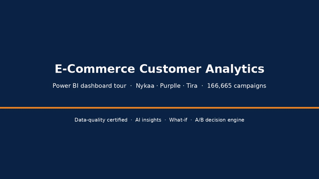
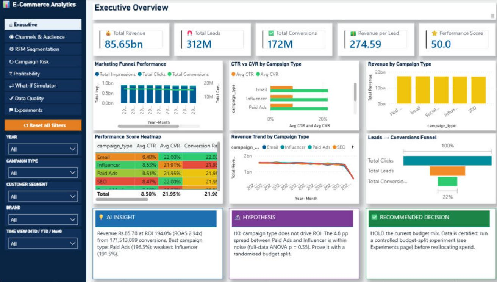
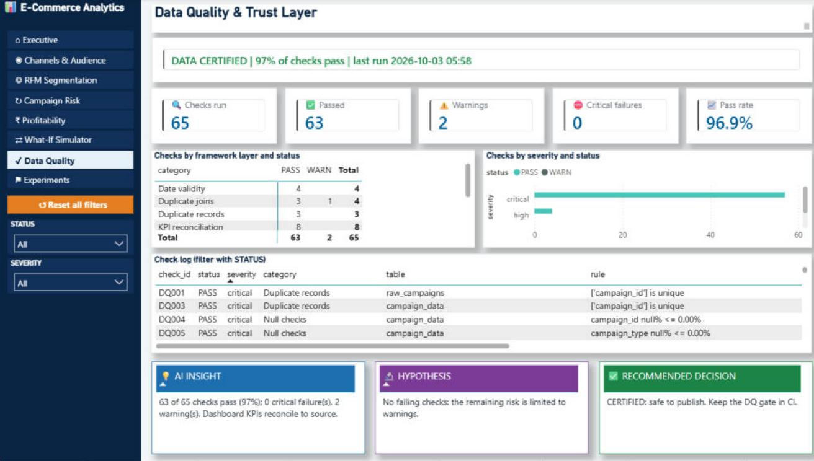
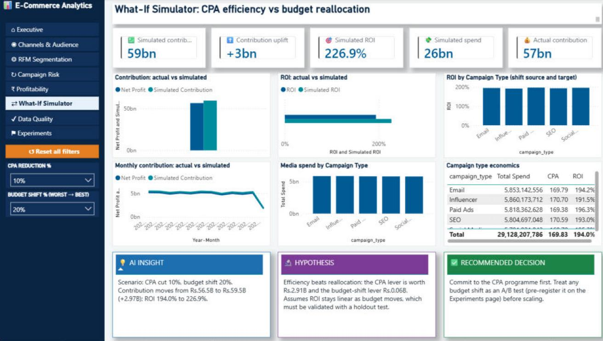
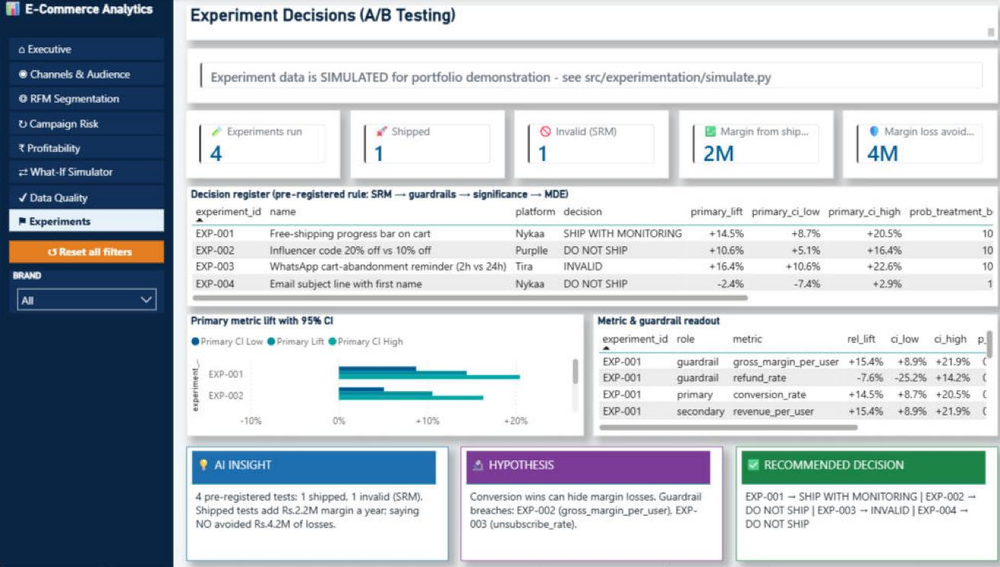

# Ecommerce Customer Analytics

**Marketing-campaign analytics on a public beauty e-commerce dataset: SQL · Python · Power BI · Data Quality · Experimentation**

> **Data disclaimer.** This is a portfolio project built on a **public Kaggle dataset** that appears to be **synthetic**.
> The brand names Nykaa, Purplle and Tira are labels in that public dataset. The project is **not affiliated with,
> endorsed by, or built on data supplied by** any of these companies, and no proprietary or internal data was used.
> All A/B-test data in this repository is **simulated**.


<p align="center"></p>

## Executive Summary

This project analyses **166,665 marketing-campaign records** from a public, likely synthetic dataset in which campaigns
are labelled Nykaa, Purplle or Tira (July 2024 – June 2025). It answers one question: *where should marketing budget go?* It takes raw CSVs through Python cleaning, DuckDB SQL, an ML model
and a Power BI semantic model, and every headline KPI is reconciled across Python, SQL and Power BI by automated
data-quality checks. The main finding is negative, and it is verified: **ROI is about 1.9–2.0x for every brand,
campaign type, segment, language and channel, and pre-launch attributes cannot predict which campaigns will
under-perform (test ROC-AUC 0.50).** The recommendation is to stop re-allocating budget on observational rankings and
use controlled tests instead. A synthetic A/B-testing notebook demonstrates that workflow.

## Business Problem

The marketing team wants to know:

1. What are total revenue, spend, ROI and funnel conversion across the three brands?
2. Does any **brand, campaign type, channel, customer segment or language** deliver better ROI?
3. Can we **predict before launch** which campaigns will under-perform?
4. Which customer segments are most valuable (RFM / CLV)?
5. Can the dashboard numbers be **trusted**?
6. How should a proposed change be **tested** before it is rolled out?

## Key Results

All values are reproduced by the code in this repository (sources in the right-hand column of
[docs/kpi_definitions.md](docs/kpi_definitions.md)). The currency is not stated in the source data; the dashboard labels it Rs.

| Metric | Result | Business Meaning |
|---|---:|---|
| Campaigns analysed | **166,665** (55,555 per brand) | Full population, no sampling |
| Revenue | **85.65 B** | Total campaign-attributed revenue |
| Media spend | **29.13 B** | `acquisition_cost` is a **per-conversion** cost, so spend = cost × conversions |
| ROI / ROAS | **194.0% / 2.94x** | Each unit of spend returns 2.94 in revenue |
| Contribution after media | **56.52 B** | Revenue − spend (no COGS in the data) |
| CTR → conversion rate | **8.50% → 21.98%** | Funnel: 9.18 B impressions → 780 M clicks → 312 M leads → 171.5 M conversions |
| CPA / AOV | **169.83 / 499.38** | Cost to acquire a conversion vs revenue per conversion |
| ROI by brand | Nykaa 1.95 · Purplle 1.94 · Tira 1.93 | No brand stands out |
| ROI by campaign type | 1.91 (Influencer) – 1.96 (Paid Ads) | ANOVA p = 0.35; η² ≈ 0 (no practical difference) |
| ROI by attributed channel | 1.92 (YouTube) – 1.97 (Email) | Equal-split attribution across multi-channel campaigns |
| Under-performance model | **ROC-AUC 0.4996**, precision 0.244, recall 0.239, F1 0.242 | Pre-launch attributes carry no predictive signal |
| Segment spread | Revenue 2.1%, AOV 0.3% between best and worst segment | Segment "value tiers" are rankings of near-identical numbers |
| Data quality | **63 pass · 2 warn · 0 fail** (65 Python checks) · **10/10** SQL checks | Dashboard certified against the raw data |
| Dashboard defect caught | ROI shown as **136,543%** → corrected to **194%** | Found by the source-to-report reconciliation layer |

## Analytical Questions

| Workstream | Question answered | Where |
|---|---|---|
| EDA | What does the funnel look like, and is the data clean? Do any groups differ in ROI? (ANOVA, Kruskal-Wallis, η²) | [01_eda.ipynb](notebooks/01_eda.ipynb) |
| SQL analytics | KPIs by brand, type, segment, month and channel; top campaigns; under-performance rates; outliers | [sql/campaign/](sql/campaign/) |
| Segment value (RFM-style) | How do the 5 segment labels rank on frequency and revenue? | [02_rfm_analysis.ipynb](notebooks/02_rfm_analysis.ipynb) |
| Campaign under-performance model | Can pre-launch attributes predict bottom-quartile ROI? | [03_churn_model.ipynb](notebooks/03_churn_model.ipynb) |
| Segment "CLV" formulas | What do standard CLV formulas give, and how sensitive are they to assumptions? | [04_clv_estimation.ipynb](notebooks/04_clv_estimation.ipynb) |
| Experimentation | How would a controlled test be designed, validated and decided? (synthetic) | [05_ab_testing_experimentation.ipynb](notebooks/05_ab_testing_experimentation.ipynb) |
| Power BI | Executive KPIs, channel and segment performance, risk, profitability, what-if, data quality, experiment decisions | [powerbi/](powerbi/) |

## Data Pipeline

```
Raw CSVs (3 brands)
→ Data Validation      65 Python checks + 10 SQL checks (exit 1 on critical failure)
→ SQL Analysis         DuckDB views + 9 analysis queries
→ Python EDA           notebook 01 (calls src/preprocessing)
→ Feature Engineering  src/feature_engineering.py: CTR, conversion rate, CPL, CPCV; month
→ ML                   campaign under-performance model, time-based split
→ Segmentation         5-segment RFM-style ranking (illustrative)
→ CLV                  segment-level formulas (illustrative)
→ Semantic Model       Power BI PBIP / TMDL, DAX, RLS, calculation group
→ Power BI             8 report pages + drill-through + tooltip
→ Recommendations
```

Full diagram: [docs/architecture.md](docs/architecture.md).

## Data

**Source:** Kaggle (public dataset) of beauty e-commerce marketing campaigns: three CSVs
(Nykaa, Purplle, Tira), 16 columns each. **Grain: one row = one campaign. There is no customer, order or product
identifier.** The data shows signs of being synthetic (identical row counts, identical date ranges, uniform spend
bounds, flat ROI). The brand names come from the public files. Results describe this dataset, not the real
performance of any company. Field definitions: [docs/data_dictionary.md](docs/data_dictionary.md).

## Data Quality

Documented in [docs/data_quality_checks.md](docs/data_quality_checks.md). Implemented checks:

| Check | Implemented as |
|---|---|
| Duplicates / primary-key uniqueness | DQ001–003, DQ036–038, SQL-DQ01 |
| Missing values, accepted values | DQ004–016, SQL-DQ02 |
| Referential integrity | DQ017–019, SQL-DQ07 |
| Date validity (explicit `dd-mm-yyyy` parsing, range) | DQ020–023, SQL-DQ04 |
| Negative values, funnel order, value ranges | DQ024–035, SQL-DQ03 |
| Join fan-out / row multiplication | DQ040–043, SQL-DQ08 |
| Revenue reconciliation (raw ↔ processed, per platform) | DQ044–049, SQL-DQ06 |
| Stored ROI = formula (proves cost is per conversion) | DQ050, SQL-DQ05 |
| Model label sanity | DQ051 |
| **SQL ↔ Python ↔ Power BI KPI reconciliation** | DQ053–065, SQL-DQ09 |
| Schema drift | SQL-DQ10 |
| Outlier profile (informational) | `sql/campaign/09_outlier_profile.sql` |

Open warnings: `channel_used` has 156 multi-channel combinations (handled with an equal-split bridge), and
`target_audience` disagrees with `customer_segment` on 80.1% of rows (a source-data limitation).

## SQL Analytics

DuckDB runs directly on the CSVs, so nothing needs installing beyond `pip`: `python -m src.sql_runner`.

| Query | Technique |
|---|---|
| [01_kpi_summary](sql/campaign/01_kpi_summary.sql) | ratio-of-sums KPIs, per-conversion spend grain |
| [02_performance_by_platform](sql/campaign/02_performance_by_platform.sql) | revenue share with `SUM(...) OVER ()` |
| [03_performance_by_campaign_type](sql/campaign/03_performance_by_campaign_type.sql) | `RANK() OVER (PARTITION BY platform ...)` |
| [04_performance_by_segment](sql/campaign/04_performance_by_segment.sql) | conditional aggregation (audience/segment agreement) |
| [05_monthly_trend](sql/campaign/05_monthly_trend.sql) | CTE, `LAG` month-over-month growth, running total |
| [06_channel_attribution](sql/campaign/06_channel_attribution.sql) | `UNNEST(STRING_SPLIT())` bridge, equal-split attribution vs naive double counting |
| [07_top_campaigns_per_platform](sql/campaign/07_top_campaigns_per_platform.sql) | `ROW_NUMBER` + `QUALIFY`, `NTILE` deciles |
| [08_underperformance_rate](sql/campaign/08_underperformance_rate.sql) | `QUANTILE_CONT`, `CROSS JOIN` threshold |
| [09_outlier_profile](sql/campaign/09_outlier_profile.sql) | Tukey IQR fences |

Without the bridge, summing revenue by channel gives **171.4 B**, double the true 85.65 B. The attribution query
keeps the total exact. The earlier customer/order SQL targeted a schema that is not in this dataset; it is kept,
clearly labelled, in [sql/legacy_order_schema/](sql/legacy_order_schema/).

## Customer Segmentation

RFM normally scores customers on **Recency** (days since last order), **Frequency** (number of orders) and **Monetary**
(total spend), then turns the scores into actions (win back lapsed high spenders, reward frequent buyers, and so on).

**This dataset has no customer grain**, so [src/segment_value.py](src/segment_value.py) applies the method to the 5
`customer_segment` labels, treating campaigns as transactions:

* Recency = days from the segment's last campaign to the last date in the data. It is 0 for all segments, so R is fixed at 3.
* Frequency = campaigns (33,071–33,557); Monetary = revenue (16.89 B–17.24 B).
* F and M are quintile scores; R+F+M ≥ 11 → "High Value", ≥ 8 → "Medium", else "Low".

**Interpretation:** segments differ by at most about 2%, so the tiers are a rank order rather than real value differences. They
should not drive spend decisions. The tables are kept because the Power BI RFM page uses them.

## Campaign Under-performance Model (formerly "Churn Prediction")

| Item | Detail |
|---|---|
| Original model (withdrawn) | "churn" = engagement < 30 OR conversion rate < 0.02 OR frequency ≤ 2. Engagement never exceeds 30.99, so **99.98%** of rows were labelled churned, and the label's own inputs were used as features. The resulting **99.99% accuracy was label leakage**, and there is no customer to churn. |
| Target | ROI below the 25th percentile of the training period (ROI < 0.04); positive rate 24.8% |
| Features | Pre-launch only: campaign type, channel mix, target audience, segment, language, platform, start month, duration |
| Preprocessing | `ColumnTransformer`: one-hot (`min_frequency=50`, `handle_unknown="ignore"`) + standard scaling inside a `Pipeline`, fit on training data only |
| Algorithm | Logistic regression, `class_weight="balanced"` |
| Validation | Time-based split: train < 2025-03-01 (117,084 rows), test ≥ 2025-03-01 (49,581 rows) |
| Decision rule | Flag the riskiest 25% of campaigns |
| **Test results** | **ROC-AUC 0.4996 · PR-AUC 0.245 (base rate 0.246) · precision 0.244 · recall 0.239 · F1 0.242** |
| Confusion matrix | TN 28,327 · FP 9,036 · FN 9,299 · TP 2,919 |
| Explainability | Logistic-regression coefficients ([reports/model/coefficients.csv](reports/model/coefficients.csv)). The largest are individual channel combinations, which is noise. SHAP is not used. |

**Conclusion:** the model performs at chance, which matches the EDA finding that no attribute explains ROI.
Do not use it to block or score campaigns. Commands: `python -m src.train_model`, `python -m src.evaluate_model`.

## Customer Lifetime Value

[04_clv_estimation.ipynb](notebooks/04_clv_estimation.ipynb) applies three formulas at segment level:

| Formula | Definition | Assessment |
|---|---|---|
| `CLV_simple` | segment revenue | identical to revenue |
| `CLV_aov` | AOV × campaign count | mixes per-order and per-campaign grain |
| `CLV_discounted` | AOV × count × r / (1 + d − r), d = 10% | r is an engagement proxy (avg / max engagement, clipped to 0.95), not retention |

**Verified findings:** AOV is about 499 in every segment (0.3% spread). The retention proxy clips to 0.95 for all five
segments, so `CLV_discounted` differs by only 1.5%. A sensitivity table shows the value changes about 7.6× between r = 0.5 and
r = 0.95. **No financial conclusion is drawn.** A real CLV needs customer-level repeat purchases (BG/NBD + Gamma-Gamma
or cohort retention curves).

## Experimentation (synthetic)

The campaign data is observational, so it cannot show causation. Experimentation is demonstrated with **clearly labelled
synthetic data**:

* **[05_ab_testing_experimentation.ipynb](notebooks/05_ab_testing_experimentation.ipynb), "Controlled A/B Testing
  Demonstration — Synthetic Experiment"**, covers: hypothesis, primary, secondary and guardrail metrics, MDE, sample size (70,229
  per arm for 3.5% → +8%), power curve, SRM check, z-test, absolute and relative uplift with CIs, practical significance,
  CUPED, Holm-adjusted segment cuts, a peeking simulation (A/A false-positive rate rises from 5.0% to 21.4% with 10
  looks), and a decision. The seeded run *misses* a true +10% effect (p = 0.059). The notebook keeps that result and
  shows, over 1,000 repeats, that the design detects the effect 94% of the time.
* **[src/experimentation/](src/experimentation/)** applies a pre-registered rule
  ([experiments/registry.yml](experiments/registry.yml)) to four simulated tests:

| Test (simulated) | Decision | Reason |
|---|---|---|
| EXP-001 free-shipping progress bar | SHIP WITH MONITORING | CVR +14.5%, refund guardrail CI still wide |
| EXP-002 20% vs 10% influencer discount | DO NOT SHIP | CVR +10.6% but margin per user −28% |
| EXP-003 WhatsApp 2h reminder | INVALID | sample ratio mismatch (SRM p ≈ 3e-126) |
| EXP-004 first-name subject line | DO NOT SHIP | CI rules out the 8% MDE |

Guide: [docs/ab_testing_guide.md](docs/ab_testing_guide.md).

## Power BI

`powerbi/dashboards/Ecommerce_Analytics.pbip` (PBIP / TMDL, so the model is diff-able in git). Set the `ProjectRoot`
parameter to your clone path.

| Page | Business question |
|---|---|
| Executive Overview | Revenue, spend, ROI, funnel, trend |
| Channel & Audience Insights | Which channels, segments and campaign types perform? |
| RFM Segmentation | Segment value ranking (illustrative) |
| Campaign Risk | Under-performance model output |
| Profitability | Revenue → media spend → contribution |
| What-If Simulator | Effect of a CPA reduction or budget shift on contribution and ROI |
| Data Quality | 65 checks, **DATA CERTIFIED / NOT CERTIFIED** banner |
| Experiment Decisions | Simulated A/B tests, CIs, guardrails, decisions |
| Campaign Detail (drill-through), KPI tooltip | Row-level detail on demand |

Features: 156 DAX measures in display folders, a Time Intelligence calculation group (MTD, QTD, YTD, prior month, MoM %,
rolling 3M), 4 row-level-security roles (one per brand plus All Brands), what-if parameters, and DAX-generated insight
text. Measure documentation: [model-documentation.md](powerbi/dashboards/Ecommerce_Analytics.SemanticModel/documentation/model-documentation.md).

| Executive Overview | Data Quality |
|---|---|
|  |  |
| **What-If Simulator** | **Experiment Decisions** |
|  |  |

## Semantic Model

| Role | Tables |
|---|---|
| Fact | `campaign_data` (166,665 campaigns), `churn_predictions` (same rows + model output), `experiment_metrics` |
| Dimension-like | `Date` (calculated calendar), `rfm_segments`, `clv_segments` (5 rows each), `experiment_decisions` |
| Other | `dq_results`, what-if parameters, `Time Intelligence` calculation group, `Measure's` |

Relationships: `campaign_data[date]` and `churn_predictions[date]` → `Date`; `campaign_data[customer_segment]` →
`rfm_segments`; `churn_predictions[customer_segment]` → `clv_segments`; `experiment_metrics` → `experiment_decisions`.
**It is not yet a full star schema:** brand, type, channel and language are columns on the fact, not dimensions. See
[docs/architecture.md](docs/architecture.md). KPI formulas and the measures that still do not reconcile (e.g. `Avg CPA`)
are listed in [docs/kpi_definitions.md](docs/kpi_definitions.md).

## Business Recommendations

Based only on the verified results above:

1. **Do not shift budget between brands, campaign types, channels, segments or languages on the basis of this data.**
   ROI differences are under 0.05x and statistically indistinguishable from noise (η² ≈ 0). Rankings on the
   dashboard should be read as "no material difference".
2. **Run controlled tests for budget decisions.** Hold out a randomised share of budget per channel (geo or
   audience split) and use the pre-registered workflow in `src/experimentation/` to measure incremental ROI.
3. **Do not deploy the under-performance model.** It performs at chance. Before modelling again, collect richer
   pre-launch features (creative, placement, budget, bid strategy, audience size).
4. **Fix the data before segment strategy.** `target_audience` and `customer_segment` disagree on 80% of campaigns.
   Customer-level RFM, churn and CLV need customer and order tables.
5. **Keep the certification gate.** Publish the dashboard only when DQ053–065 and SQL-DQ09 pass. This gate caught a
   700× ROI overstatement.

## Limitations

* **Dataset:** public Kaggle data that appears synthetic; campaign grain only; no customers, orders, products, COGS
  or currency; 12 months, so no year-over-year comparison; June 2025 is partial.
* **Observational:** campaign comparisons are correlational. Nothing here establishes that a channel or campaign
  type *causes* a difference.
* **Modelling:** the under-performance model has no predictive power. "Churn", RFM and CLV outputs are segment-level
  illustrations kept for the dashboard, not customer analytics.
* **Assumptions:** `acquisition_cost` is per conversion (verified against the source ROI on every row);
  CLV uses a 10% discount rate and an engagement-based retention proxy.
* **Data quality:** 80% audience/segment mismatch; multi-valued channel field; the Power BI KPI snapshot is exported
  manually; `models/churn_model.pkl` is saved with scikit-learn 1.9.0, so pickles are version-specific and you should retrain after upgrading.
* **Experiments:** all experiment data is simulated.

## Reproducibility

```bash
git clone https://github.com/abdulrab787/ecommerce-customer-analytics.git
cd ecommerce-customer-analytics
python -m venv .venv && source .venv/bin/activate     # Windows: .venv\Scripts\activate
pip install -r requirements.txt

python -m src.preprocessing          # raw CSVs -> data/processed/campaign_data_cleaned.csv
python -m src.segment_value          # -> rfm_segments.csv, clv_segments.csv
python -m src.train_model            # -> models/churn_model.pkl, churn_predictions.csv, reports/model/metrics.json
python -m src.evaluate_model         # -> reports/model/evaluation.json, confusion_matrix.csv, coefficients.csv
python -m src.sql_runner             # DuckDB analysis + SQL checks -> reports/sql/
python -m src.experimentation.simulate && python -m src.experimentation.decide   # -> reports/experiments/
python -m src.data_quality.runner --config config/dq_rules.yml                   # -> reports/dq/ (exit 1 on critical)
pytest -q tests

jupyter nbconvert --to notebook --execute --inplace notebooks/*.ipynb            # re-run all notebooks
```

On Windows, `run_quality.ps1` runs the tests, SQL, experiments and DQ gate in one step. CI runs the same on every push
([.github/workflows/quality.yml](.github/workflows/quality.yml)).

**Power BI:** open `powerbi/dashboards/Ecommerce_Analytics.pbip` in Power BI Desktop, set the `ProjectRoot`
parameter to your clone folder (ending with `\`), and refresh. To re-certify, run `powerbi/dq/kpi_snapshot.dax` in DAX
query view, save the result to `reports/dq/powerbi_kpi_snapshot.csv`, and rerun the DQ runner.

## Project Structure

```
ecommerce-customer-analytics/
├── .github/workflows/quality.yml   CI: tests, SQL, experiments, DQ gate
├── config/dq_rules.yml             65 data-quality rules
├── data/
│   ├── raw/                        nykaa / purplle / tira campaign CSVs
│   └── processed/                  cleaned fact, model output, segment tables
├── docs/
│   ├── architecture.md             data-flow and model diagrams
│   ├── data_dictionary.md
│   ├── kpi_definitions.md
│   ├── data_quality_checks.md
│   ├── ab_testing_guide.md
│   └── PROJECT_AUDIT.md            audit that found and fixed the dashboard KPI errors
├── experiments/registry.yml        A/B pre-registration (simulated tests)
├── models/churn_model.pkl          campaign under-performance model
├── notebooks/                      01 EDA · 02 segment RFM · 03 model · 04 segment CLV · 05 A/B (synthetic)
├── powerbi/
│   ├── dashboards/                 Ecommerce_Analytics.pbip (+ .Report PBIR, .SemanticModel TMDL)
│   ├── measures/                   DAX exports
│   ├── dq/kpi_snapshot.dax         KPI export for source-to-report checks
│   └── assets/                     screenshots, tour video
├── reports/
│   ├── dq/                         DQ results (feeds Power BI)
│   ├── experiments/                decisions, metrics, memos (simulated)
│   ├── model/                      metrics, evaluation, confusion matrix, coefficients
│   └── sql/                        SQL query outputs, SQL DQ results, KPI reconciliation
├── sql/
│   ├── 00_create_views.sql         DuckDB views over the CSVs
│   ├── campaign/                   9 analysis queries
│   ├── data_quality/               10 validation queries
│   └── legacy_order_schema/        earlier SQL for a schema not in this dataset
├── src/
│   ├── preprocessing.py · feature_engineering.py · segment_value.py
│   ├── train_model.py · evaluate_model.py · sql_runner.py
│   ├── data_quality/               checks, KPI definitions, runner
│   └── experimentation/            stats, simulation, decision engine
├── tests/                          16 unit tests
├── requirements.txt
└── run_quality.ps1
```

## Skills Demonstrated

**Data Analyst / BI:** SQL (CTEs, window functions, QUALIFY, UNNEST), Python, pandas, NumPy, EDA, statistical testing
(ANOVA, Kruskal-Wallis, effect sizes), Power BI, DAX, time intelligence, calculation groups, row-level security,
what-if analysis, KPI design, data storytelling, marketing analytics (funnel, ROI, ROAS, CPA, attribution).

**Analytics Engineering:** data modelling (semantic model, grain, join cardinality), ETL, DuckDB, PBIP/TMDL version
control, reproducible pipelines, CI with GitHub Actions, unit testing (pytest), single-source KPI definitions.

**Data Quality:** config-driven validation framework, referential integrity, reconciliation (raw ↔ processed ↔ SQL ↔
Power BI), schema-drift and fan-out checks, certification gating, root-cause analysis of KPI defects.

**Data Science / Experimentation:** scikit-learn pipelines, leakage detection, time-based validation, ROC/PR
evaluation, A/B test design (power, MDE, SRM, CUPED, Holm, sequential-testing pitfalls), statsmodels, SciPy.

## Author

**Abdurrab**: Data Analyst · BI Developer · Dubai, UAE
