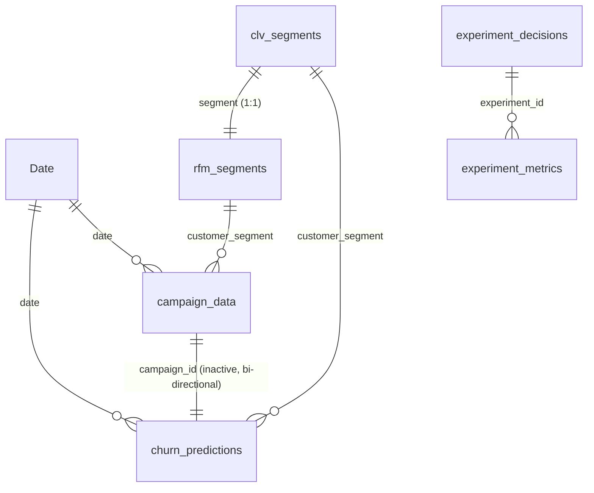

# Architecture

## Data flow

```mermaid
flowchart LR
    subgraph Sources
        A1[nykaa_campaign_data.csv]
        A2[purplle_campaign_data.csv]
        A3[tira_campaign_data.csv]
    end

    A1 & A2 & A3 --> P[src.preprocessing<br/>union + platform + date parse<br/>src.feature_engineering]
    P --> F[(campaign_data_cleaned.csv<br/>fact: 1 row per campaign)]

    F --> M[src.train_model / evaluate_model<br/>campaign under-performance<br/>time-based split]
    M --> CP[(churn_predictions.csv<br/>models/churn_model.pkl<br/>reports/model/)]
    F --> SV[src.segment_value<br/>segment RFM / CLV<br/>illustrative]
    SV --> SEG[(rfm_segments.csv<br/>clv_segments.csv)]

    A1 & A2 & A3 & F & CP & SEG --> DQ[src.data_quality.runner<br/>65 checks]
    A1 & A2 & A3 & F & CP & SEG --> SQL[src.sql_runner · DuckDB<br/>9 analysis queries<br/>10 SQL checks]
    DQ --> DQR[(reports/dq/)]
    SQL --> SQLR[(reports/sql/)]

    REG[experiments/registry.yml<br/>pre-registration] --> SIM[src.experimentation<br/>simulate → decide]
    SIM --> EXR[(reports/experiments/<br/>SIMULATED)]

    F & CP & SEG & DQR & EXR --> PBI[Power BI semantic model<br/>PBIP / TMDL · DAX · RLS]
    PBI --> R[Report: 8 pages<br/>+ drill-through + tooltip]
    PBI -. kpi_snapshot.dax .-> SNAP[(powerbi_kpi_snapshot.csv)]
    SNAP --> DQ
    SNAP --> SQL

    F --> NB[notebooks 01–04<br/>call src/ modules]
    NB5[notebook 05<br/>synthetic A/B demo] --> SIMSTATS[src.experimentation.stats]
```

The dotted line is the one manual step: the Power BI KPI snapshot is exported with `powerbi/dq/kpi_snapshot.dax` and
compared back to the source by both quality layers (DQ053–065, SQL-DQ09).

## Components

| Component | Path | Role |
|---|---|---|
| Ingestion and cleaning | `src/preprocessing.py`, `src/feature_engineering.py` | Union three brand files, keep `platform`, parse `dd-mm-yyyy` explicitly, derive CTR / conversion rate / CPL / CPCV with spend = cost per conversion × conversions |
| Model | `src/train_model.py`, `src/evaluate_model.py` | Logistic regression on pre-launch attributes, trained before 2025-03-01 and tested after |
| Segment tables | `src/segment_value.py` | 5-row segment RFM and CLV tables for the Power BI pages (illustrative) |
| Python DQ | `src/data_quality/`, `config/dq_rules.yml` | 65 config-driven checks across 9 layers; exit 1 on critical failure |
| SQL | `sql/00_create_views.sql`, `sql/campaign/`, `sql/data_quality/`, `src/sql_runner.py` | DuckDB views over the CSVs, analysis queries, SQL checks, three-way KPI reconciliation |
| Experimentation | `src/experimentation/`, `experiments/registry.yml` | Sample size, SRM, z / Welch tests, CUPED, Bayesian readout, Holm, deterministic decision rule; **simulated data** |
| Notebooks | `notebooks/01–05` | Analysis narrative; call `src/` so notebook and pipeline results cannot drift |
| BI | `powerbi/dashboards/Ecommerce_Analytics.pbip` | Semantic model (TMDL), DAX measures, 4 RLS roles, Time Intelligence calculation group, what-if parameters |
| CI | `.github/workflows/quality.yml` | pytest → SQL runner → experiment readouts → DQ gate on every push |

## Semantic model (as built)



* **Fact tables:** `campaign_data` (166,665 campaigns), `churn_predictions` (same rows plus model label/score),
  `experiment_metrics`.
* **Dimension-like tables:** `Date` (calculated `CALENDAR` over the campaign dates), `rfm_segments` and
  `clv_segments` (5 rows each), `experiment_decisions`.
* **Standalone:** `dq_results` (Data Quality page), what-if parameter tables (`CPA Reduction %`, `Budget Shift %`),
  `Waterfall_Steps`, `Time Intelligence` calculation group, `Measure's` (156 measures).
* **Security:** RLS roles `Brand - Nykaa`, `Brand - Purplle`, `Brand - Tira`, `All Brands` filter `campaign_data[platform]`,
  `churn_predictions` (by `campaign_id` prefix) and `experiment_decisions`.

**This is not a full star schema.** Brand, campaign type, channel, segment and language live as text columns on the fact
rather than in separate dimension tables, `channel_used` is multi-valued, and `churn_predictions` duplicates the fact's
columns. A star-schema refactor (`dim_platform`, `dim_campaign_type`, `dim_segment`, `dim_language`, a
`campaign_channel` bridge, model columns folded into the fact) is listed under future improvements in the README.
