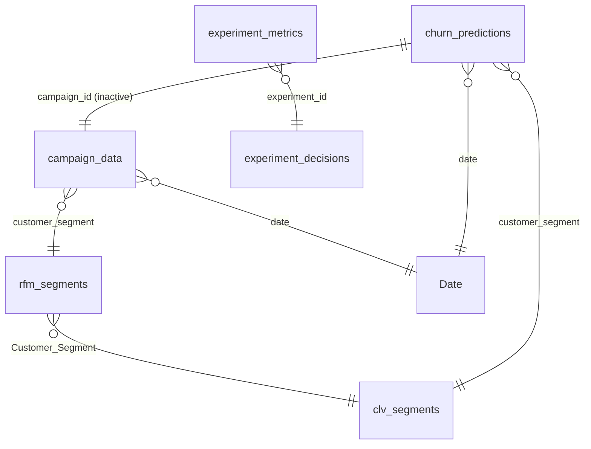

# Ecommerce_Analytics — Semantic Model Documentation
_Generated: 2026-10-03_ · compatibility level 1606 · Import mode

## Overview
Campaign-level marketing analytics for three beauty brands (Nykaa, Purplle, Tira): 166,665 campaign rows (Jul 2024 – Jun 2025), segment-level RFM/CLV outputs, churn-model outputs, plus two governance layers loaded from the repo's Python pipeline: **data-quality results** (`dq_results`) and **experiment decisions** (`experiment_decisions`, `experiment_metrics` — simulated data). A `Time Intelligence` calculation group and four brand RLS roles are defined.

## Relationship Diagram


| From | To | Cardinality | Cross-filter | Active |
|---|---|---|---|---|
| rfm_segments.Customer_Segment | clv_segments.customer_segment | *:1 | oneDirection | true |
| campaign_data.date | Date.Date | *:1 | oneDirection | true |
| churn_predictions.date | Date.Date | *:1 | oneDirection | true |
| campaign_data.customer_segment | rfm_segments.Customer_Segment | *:1 | oneDirection | true |
| churn_predictions.customer_segment | clv_segments.customer_segment | *:1 | oneDirection | true |
| churn_predictions.campaign_id | campaign_data.campaign_id | 1:1 | bothDirections | false |
| experiment_metrics.experiment_id | experiment_decisions.experiment_id | *:1 | oneDirection | true |

The inactive 1:1 `churn_predictions ↔ campaign_data` relationship is not used by any measure (no `USERELATIONSHIP`).

## Tables

### Budget Shift %

Business-facing columns

| Column | Type | Format | Note |
|---|---|---|---|
| Budget Shift % |  | 0% |  |

### CPA Reduction %

Business-facing columns

| Column | Type | Format | Note |
|---|---|---|---|
| CPA Reduction % |  | 0% |  |

### Date

Business-facing columns

| Column | Type | Format | Note |
|---|---|---|---|
| Date |  | General Date |  |
| Year |  | 0 |  |
| Month Number |  | 0 |  |
| Month Name |  |  |  |
| Quarter |  |  |  |
| Year-Month |  |  |  |

### Measure's

Hidden / technical columns

| Column | Type | Format | Note |
|---|---|---|---|
| Value |  | 0 |  |

### RFM_Segment_Table

Business-facing columns

| Column | Type | Format | Note |
|---|---|---|---|
| RFM_Segment |  |  |  |

### Table _(hidden)_

Business-facing columns

| Column | Type | Format | Note |
|---|---|---|---|
| Column |  | 0 |  |

### Time Intelligence _(calculation group)_

Business-facing columns

| Column | Type | Format | Note |
|---|---|---|---|
| Time Intelligence | string |  |  |

### Waterfall_Steps

Business-facing columns

| Column | Type | Format | Note |
|---|---|---|---|
| Step |  |  |  |
| SortOrder |  | 0 |  |

### campaign_data

Business-facing columns

| Column | Type | Format | Note |
|---|---|---|---|
| campaign_id | string |  |  |
| campaign_type | string |  |  |
| channel_used | string |  |  |
| customer_segment | string |  |  |
| date | dateTime | Long Date |  |
| Recency |  | 0 | calculated |
| Segment |  |  | calculated |
| platform | string |  |  |

Hidden / technical columns

| Column | Type | Format | Note |
|---|---|---|---|
| target_audience | string |  |  |
| duration | int64 | 0 |  |
| impressions | int64 | 0 |  |
| clicks | int64 | 0 |  |
| leads | int64 | 0 |  |
| conversions | int64 | 0 |  |
| revenue | int64 | 0 |  |
| acquisition_cost | double |  |  |
| roi | double |  |  |
| language | string |  |  |
| engagement_score | double |  |  |
| CTR | double |  |  |
| Conversion_Rate | double |  |  |
| CPL | double |  |  |
| CPCV | double |  |  |

### churn_predictions

Business-facing columns

| Column | Type | Format | Note |
|---|---|---|---|
| campaign_id | string |  |  |
| campaign_type | string |  |  |
| target_audience | string |  |  |
| duration | int64 | 0 |  |
| channel_used | string |  |  |
| impressions | int64 | 0 |  |
| clicks | int64 | 0 |  |
| leads | int64 | 0 |  |
| conversions | int64 | 0 |  |
| revenue | int64 | 0 |  |
| acquisition_cost | double |  |  |
| roi | double |  |  |
| language | string |  |  |
| engagement_score | double |  |  |
| customer_segment | string |  |  |
| date | dateTime | Long Date |  |
| CTR | double |  |  |
| Conversion_Rate | double |  |  |
| CPL | double |  |  |
| CPCV | double |  |  |
| frequency | int64 | 0 |  |
| churn | int64 | 0 |  |
| Churn_Prediction | int64 | 0 |  |

### clv_segments

Business-facing columns

| Column | Type | Format | Note |
|---|---|---|---|
| customer_segment | string |  |  |
| total_conversions | int64 | 0 |  |
| total_leads | int64 | 0 |  |
| total_clicks | int64 | 0 |  |
| total_impressions | int64 | 0 |  |
| avg_engagement | double |  |  |
| frequency | int64 | 0 |  |
| CLV_simple | int64 | 0 |  |
| AOV | double |  |  |
| CLV_aov | double |  |  |
| RRetention_Rate | double |  |  |
| Retention_Rate | double |  |  |
| CLV_discounted | double |  |  |

### dq_results

Business-facing columns

| Column | Type | Format | Note |
|---|---|---|---|
| run_ts | dateTime | yyyy-mm-dd hh:nn |  |
| check_id | string |  |  |
| check | string |  |  |
| category | string |  |  |
| table | string |  |  |
| rule | string |  |  |
| severity | string |  |  |
| observed | string |  |  |
| expected | string |  |  |
| failing_rows | int64 | #,0 |  |
| detail | string |  |  |
| status | string |  |  |

Hidden / technical columns

| Column | Type | Format | Note |
|---|---|---|---|
| passed | string |  |  |
| sample | string |  |  |
| severity_rank | int64 |  |  |

### experiment_decisions

Business-facing columns

| Column | Type | Format | Note |
|---|---|---|---|
| experiment_id | string |  |  |
| name | string |  |  |
| platform | string |  |  |
| owner | string |  |  |
| start | dateTime | yyyy-mm-dd |  |
| end | dateTime | yyyy-mm-dd |  |
| primary_metric | string |  |  |
| planned_n_per_arm | int64 | #,0 |  |
| planned_days | int64 |  |  |
| actual_n_control | int64 | #,0 |  |
| actual_n_treatment | int64 | #,0 |  |
| srm_p_value | double | 0.0E+00 |  |
| srm_detected | string |  |  |
| primary_lift | double | +0.0%;-0.0%;0.0% |  |
| primary_ci_low | double | +0.0%;-0.0%;0.0% |  |
| primary_ci_high | double | +0.0%;-0.0%;0.0% |  |
| primary_p_value | double | 0.0000 |  |
| prob_treatment_better | double | 0.0% |  |
| expected_loss | double | 0.00% |  |
| guardrails | string |  |  |
| annual_revenue_impact | double | #,0 |  |
| annual_margin_impact | double | #,0 |  |
| decision | string |  |  |
| reason | string |  |  |

Hidden / technical columns

| Column | Type | Format | Note |
|---|---|---|---|
| is_simulated | int64 |  |  |

### experiment_metrics

Business-facing columns

| Column | Type | Format | Note |
|---|---|---|---|
| metric | string |  |  |
| control | double | #,0.0000 |  |
| treatment | double | #,0.0000 |  |
| rel_lift | double | +0.0%;-0.0%;0.0% |  |
| ci_low | double | +0.0%;-0.0%;0.0% |  |
| ci_high | double | +0.0%;-0.0%;0.0% |  |
| p_value | double | 0.0000 |  |
| prob_treatment_better | double | 0.0% |  |
| role | string |  |  |
| status | string |  |  |
| experiment_id | string |  |  |

Hidden / technical columns

| Column | Type | Format | Note |
|---|---|---|---|
| metric_type | string |  |  |
| abs_diff | double |  |  |
| n_control | int64 |  |  |
| n_treatment | int64 |  |  |
| expected_loss | double |  |  |
| cuped_variance_reduction | double |  |  |
| metric_key | string |  |  |

### rfm_segments

Business-facing columns

| Column | Type | Format | Note |
|---|---|---|---|
| Customer_Segment | string |  |  |
| M_Score | int64 | 0 |  |
| Frequency |  | 0 | calculated |
| Monetary |  | 0 | calculated |
| F_Score |  | 0 | calculated |

## Measures

### (no folder)

**Campaign Row Count (Filtered)** · table `Date` · format `0`
```dax
COUNTROWS( campaign_data )
```

**Distinct Campaign Count** · table `Date` · format `0`
```dax
DISTINCTCOUNT(campaign_data[campaign_id])
```

**RFM_Segment_Filter** · table `RFM_Segment_Table` · format `0`
```dax
IF(
    SELECTEDVALUE(RFM_Segment_Table[RFM_Segment]) = [RFM_Segment],
    1,
    0
)
```

**Waterfall_Steps** · table `Measure's`
```dax
DATATABLE(
    "Step", STRING,
    {
        {"Total Revenue"},
        {"CLV Uplift"},
        {"Churn Loss"},
        {"Net Profit"}
    }
)
```

### _AI Insights

**AI Channels Decision** · table `Measure's`
```dax
"Fix audience labelling at source (DQ052), split multi-channel values into a bridge table (DQ039), then run a segment-targeted A/B test before moving spend."
```

**AI Channels Hypothesis** · table `Measure's`
```dax
IF ( ISBLANK ( [Total Revenue] ), "Select a wider filter to generate a hypothesis.",
VAR _s = ADDCOLUMNS ( VALUES ( campaign_data[customer_segment] ), "@rev", [Total Revenue] )
VAR _share = DIVIDE ( MAXX ( _s, [@rev] ), [Total Revenue] )
RETURN
IF ( COUNTROWS ( _s ) < 2, "Only one segment is selected. Select several segments to compare them.",
IF ( _share < 0.25,
    "Segments contribute almost equally (top share " & FORMAT ( _share, "0%" ) & "). target_audience disagrees with customer_segment on 80% of rows, so labelling noise may be hiding real segment differences.",
    "The leading segment over-indexes (" & FORMAT ( _share, "0%" ) & " of revenue); a segment-specific creative should lift its conversion rate further." ) ) )
```

**AI Channels Insight** · table `Measure's`
```dax
IF ( ISBLANK ( [Total Revenue] ), "No data for this selection. Press the orange Reset all filters button.",
VAR _s = ADDCOLUMNS ( VALUES ( campaign_data[customer_segment] ), "@rev", [Total Revenue], "@cvr", [Conversion Rate] )
VAR _topSeg = MAXX ( TOPN ( 1, _s, [@rev], DESC ), campaign_data[customer_segment] )
VAR _share = DIVIDE ( MAXX ( _s, [@rev] ), [Total Revenue] )
VAR _cvrSeg = MAXX ( TOPN ( 1, _s, [@cvr], DESC ), campaign_data[customer_segment] )
RETURN
"Top revenue segment: " & _topSeg & " (" & FORMAT ( _share, "0.0%" ) & " of revenue). Highest conversion rate: "
    & _cvrSeg & " (" & FORMAT ( MAXX ( _s, [@cvr] ), "0.00%" ) & "). Blended CPA Rs." & FORMAT ( [CPA], "#,0" ) & "." )
```

**AI Churn Decision** · table `Measure's`
```dax
"Do not gate launches on this score. Monitor CPA and CTR in week 1 of every campaign and pause any that trend below the ROI threshold. The old 99.98% churn label was removed because it leaked into the features."
```

**AI Churn Hypothesis** · table `Measure's`
```dax
"Pre-launch attributes (campaign type, channel, audience, language, duration, brand, month) do not predict under-performance: the time-split test AUC is 0.50, no better than a coin flip. Outcomes are driven by in-flight execution, not set-up."
```

**AI Churn Insight** · table `Measure's`
```dax
IF ( ISBLANK ( [Total Revenue] ), "No data for this selection. Press the orange Reset all filters button.",
"Under-performance rate " & FORMAT ( [Churn Rate], "0.0%" ) & " (campaigns with ROI below the training-period 25th percentile). The risk model flags "
    & FORMAT ( [Churned Customer], "#,0" ) & " campaigns; agreement with actual outcome " & FORMAT ( [Churn Prediction Accuracy], "0.0%" ) & "." )
```

**AI DQ Decision** · table `Measure's`
```dax
IF ( [DQ Critical Failed] > 0,
    "BLOCK certification: fix the failing exports, re-run src/data_quality/runner.py, then refresh the model.",
    "CERTIFIED: safe to publish. Keep the DQ gate in CI." )
```

**AI DQ Hypothesis** · table `Measure's`
```dax
VAR _f = CONCATENATEX ( FILTER ( dq_results, dq_results[status] = "FAIL" ), dq_results[check_id] & " " & dq_results[rule], "; ", dq_results[check_id], ASC )
RETURN IF ( ISBLANK ( _f ), "No failing checks: the remaining risk is limited to warnings.",
    "The remaining failures come from upstream exports, not the BI layer: " & _f & "." )
```

**AI DQ Insight** · table `Measure's`
```dax
FORMAT ( [DQ Passed], "0" ) & " of " & FORMAT ( [DQ Checks], "0" ) & " checks pass (" & FORMAT ( [DQ Pass Rate], "0%" ) & "); "
    & FORMAT ( [DQ Critical Failed], "0" ) & " critical failure(s), " & FORMAT ( [DQ Warnings], "0" ) & " warning(s). Dashboard KPIs reconcile to source."
```

**AI Executive Decision** · table `Measure's`
```dax
IF ( ISBLANK ( [Total Revenue] ), "No decision: no data in the current selection.",
VAR _t = ADDCOLUMNS ( VALUES ( campaign_data[campaign_type] ), "@r", [ROI] )
VAR _best = MAXX ( TOPN ( 1, _t, [@r], DESC ), campaign_data[campaign_type] )
VAR _worst = MAXX ( TOPN ( 1, _t, [@r], ASC ), campaign_data[campaign_type] )
VAR _spread = MAXX ( _t, [@r] ) - MINX ( _t, [@r] )
RETURN
IF ( _spread < 0.05,
    IF ( [DQ Critical Failed] > 0, "HOLD the current budget mix. Clear the " & [DQ Critical Failed] & " critical data-quality issue(s) and run controlled experiments before reallocating spend.", "HOLD the current budget mix. Data is certified; run a controlled budget-split experiment (see Experiments page) before reallocating spend." ),
    "TEST: shift 10% of " & _worst & " budget to " & _best & " for 4 weeks with a holdout. Ship only if the ROI-lift CI excludes 0." ) )
```

**AI Executive Hypothesis** · table `Measure's`
```dax
IF ( ISBLANK ( [Total Revenue] ), "Select a wider filter to generate a hypothesis.",
VAR _t = ADDCOLUMNS ( VALUES ( campaign_data[campaign_type] ), "@r", [ROI] )
VAR _best = MAXX ( TOPN ( 1, _t, [@r], DESC ), campaign_data[campaign_type] )
VAR _worst = MAXX ( TOPN ( 1, _t, [@r], ASC ), campaign_data[campaign_type] )
VAR _spread = MAXX ( _t, [@r] ) - MINX ( _t, [@r] )
RETURN
IF ( COUNTROWS ( _t ) < 2, "Only one campaign type is selected, so there is nothing to compare. Select two or more to test whether campaign type drives ROI.",
IF ( _spread < 0.05,
    "H0: campaign type does not drive ROI. The " & FORMAT ( _spread * 100, "0.0" ) & " pp spread between "
        & _best & " and " & _worst & " is within noise (full-data ANOVA p = 0.35). Prove it with a randomised budget split.",
    "H1: moving budget from " & _worst & " to " & _best & " raises blended ROI by up to " & FORMAT ( _spread * 100, "0.0" ) & " pp." ) ) )
```

**AI Executive Insight** · table `Measure's`
```dax
IF ( ISBLANK ( [Total Revenue] ), "No data for this selection. Press the orange Reset all filters button.",
VAR _t = ADDCOLUMNS ( VALUES ( campaign_data[campaign_type] ), "@r", [ROI] )
VAR _best = MAXX ( TOPN ( 1, _t, [@r], DESC ), campaign_data[campaign_type] )
VAR _worst = MAXX ( TOPN ( 1, _t, [@r], ASC ), campaign_data[campaign_type] )
VAR _bestR = MAXX ( _t, [@r] )
VAR _worstR = MINX ( _t, [@r] )
RETURN
"Revenue Rs." & FORMAT ( [Total Revenue] / 1e9, "#,0.0" ) & "B at ROI " & FORMAT ( [ROI], "0.0%" )
    & " (ROAS " & FORMAT ( [ROAS], "0.00" ) & "x) from " & FORMAT ( [Total Conversions], "#,0" ) & " conversions. "
    & "Best campaign type: " & _best & " (" & FORMAT ( _bestR, "0.0%" ) & "); weakest: " & _worst & " (" & FORMAT ( _worstR, "0.0%" ) & ")." )
```

**AI Experiment Decision** · table `Measure's`
```dax
CONCATENATEX ( experiment_decisions, experiment_decisions[experiment_id] & " " & UNICHAR ( 8594 ) & " " & experiment_decisions[decision], "  |  ", experiment_decisions[experiment_id], ASC )
```

**AI Experiment Hypothesis** · table `Measure's`
```dax
VAR _b = CONCATENATEX ( FILTER ( experiment_metrics, experiment_metrics[status] = "BREACH" ), experiment_metrics[experiment_id] & " (" & experiment_metrics[metric] & ")", ", " )
RETURN "Conversion wins can hide margin losses. Guardrail breaches: " & IF ( ISBLANK ( _b ), "none", _b ) & "."
```

**AI Experiment Insight** · table `Measure's`
```dax
FORMAT ( [Experiments Run], "0" ) & " pre-registered tests: " & FORMAT ( [Experiments Shipped], "0" ) & " shipped, "
    & FORMAT ( [Invalid Tests], "0" ) & " invalid (SRM). Shipped tests add Rs." & FORMAT ( [Shipped Annual Margin Impact] / 1e6, "#,0.0" )
    & "M margin a year; saying NO avoided Rs." & FORMAT ( [Margin Loss Avoided] / 1e6, "#,0.0" ) & "M of losses."
```

**AI Profit Decision** · table `Measure's`
```dax
IF ( ISBLANK ( [Total Revenue] ), "No decision: no data in the current selection.",
"Prioritise CPA efficiency (bids, creative and landing-page tests) over channel reallocation. Track CPA weekly against a Rs."
    & FORMAT ( [CPA] * 0.9, "#,0" ) & " target." )
```

**AI Profit Hypothesis** · table `Measure's`
```dax
IF ( ISBLANK ( [Total Revenue] ), "Select a wider filter to generate a hypothesis.",
"A 10% CPA reduction would add Rs." & FORMAT ( 0.1 * [Total Spend] / 1e9, "#,0.0" ) & "B contribution, more than any campaign-type reallocation (ROI spread "
    & FORMAT ( [ROI Spread (Campaign Type)] * 100, "0.0" ) & " pp)." )
```

**AI Profit Insight** · table `Measure's`
```dax
IF ( ISBLANK ( [Total Revenue] ), "No data for this selection. Press the orange Reset all filters button.",
"Contribution after media Rs." & FORMAT ( [Net Profit] / 1e9, "#,0.0" ) & "B (" & FORMAT ( DIVIDE ( [Net Profit], [Total Revenue] ), "0.0%" )
    & " of revenue). Media spend is " & FORMAT ( [Media Spend Share], "0.0%" ) & " of revenue at CPA Rs." & FORMAT ( [CPA], "#,0" ) & "." )
```

**AI RFM Decision** · table `Measure's`
```dax
"ILLUSTRATIVE ONLY: do not target campaigns from this RFM view. Load customer-level transactions, then rebuild RFM per customer."
```

**AI RFM Hypothesis** · table `Measure's`
```dax
"With customer-level orders, the top 20% of customers by monetary value should hold 60-80% of revenue (Pareto). Segment-level RFM cannot test this."
```

**AI RFM Insight** · table `Measure's`
```dax
"RFM is scored on " & COUNTROWS ( rfm_segments ) & " segment rows (no customer IDs in the source). Average RFM score "
    & FORMAT ( [AVG_RFM_Score], "0.0" ) & "; Recency is constant because every segment buys every day."
```

**AI WhatIf Decision** · table `Measure's`
```dax
IF ( [Selected CPA Reduction] = 0 && [Selected Budget Shift] = 0,
    "Move the sliders in the left panel to test a scenario.",
    "Commit to the CPA programme first. Treat any budget shift as an A/B test (pre-register it on the Experiments page) before scaling." )
```

**AI WhatIf Hypothesis** · table `Measure's`
```dax
VAR _cpa = [Total Spend] * [Selected CPA Reduction]
VAR _shift = [Simulated Revenue] - [Total Revenue]
RETURN "Efficiency beats reallocation: the CPA lever is worth Rs." & FORMAT ( _cpa / 1e9, "#,0.00" ) & "B and the budget-shift lever Rs."
    & FORMAT ( _shift / 1e9, "#,0.00" ) & "B. Assumes ROI stays linear as budget moves, which must be validated with a holdout test."
```

**AI WhatIf Insight** · table `Measure's`
```dax
IF ( ISBLANK ( [Total Revenue] ), "No data for this selection. Press the orange Reset all filters button.",
"Scenario: CPA cut " & FORMAT ( [Selected CPA Reduction], "0%" ) & ", budget shift " & FORMAT ( [Selected Budget Shift], "0%" )
    & ". Contribution moves from Rs." & FORMAT ( [Net Profit] / 1e9, "#,0.0" ) & "B to Rs." & FORMAT ( [Simulated Contribution] / 1e9, "#,0.0" )
    & "B (" & FORMAT ( [Contribution Uplift] / 1e9, "+#,0.00;-#,0.00" ) & "B); ROI " & FORMAT ( [ROI], "0.0%" ) & " to " & FORMAT ( [Simulated ROI], "0.0%" ) & "." )
```

**ROI Spread (Campaign Type)** · table `Measure's` · format `0.0%`
```dax
VAR _t = ADDCOLUMNS ( VALUES ( campaign_data[campaign_type] ), "@r", [ROI] )
RETURN MAXX ( _t, [@r] ) - MINX ( _t, [@r] )
```

### _Channel

**Campaign Row Count** · table `Measure's` · format `0`
```dax
COUNTROWS(campaign_data)
```

**CampaignType** · table `Measure's`
```dax
DISTINCT( campaign_data[campaign_type] )
```

**Churn Loss** · table `Measure's`
```dax
[Churn Rate] * [CLV Uplift]
```

**Churn Prediction Accuracy** · table `Measure's`
```dax
DIVIDE(
    SUMX(
        churn_predictions,
        IF(churn_predictions[churn] = churn_predictions[Churn_Prediction], 1, 0)
    ),
    COUNTROWS(churn_predictions)
)
```

**Conversions by Channel** · table `Measure's` · format `0`
```dax
CALCULATE(
    [Total Conversions],
    ALLEXCEPT(campaign_data, campaign_data[channel_used])
)
```

**Leads by Channel** · table `Measure's` · format `0`
```dax
CALCULATE(
    [Total Leads],
    ALLEXCEPT(campaign_data, campaign_data[channel_used])
)
```

**Revenue by Channel** · table `Measure's`
```dax
CALCULATE(
    [Total Revenue],
    ALLEXCEPT(campaign_data, campaign_data[channel_used])
)
```

### _Cost & ROI

**CLV Uplift** · table `Measure's` · format `0`
```dax
[M_Monetary]
```

**Cost per Conversion** · table `Measure's` · format `#,0.00`
```dax
[CPA]
```

**CPA** · table `Measure's` · format `#,0.00`
```dax
DIVIDE ( [Total Spend], [Total Conversions] )
```

**CPL** · table `Measure's` · format `#,0.00`
```dax
DIVIDE ( [Total Spend], [Total Leads] )
```

**Lifetime Loss** · table `Measure's`
```dax
SUMX(
    clv_segments,
    clv_segments[CLV_discounted] * AVERAGE(churn_predictions[churn])
)
```

**Marketing ROI** · table `Measure's` · format `0.00x`
```dax
[ROAS]
```

**Media Spend Share** · table `Measure's` · format `0.0%`
```dax
DIVIDE ( [Total Spend], [Total Revenue] )
```

**Net Profit** · table `Measure's` · format `#,0`
```dax
[Total Revenue] - [Total Spend]
```

**Predicted Churn Rate** · table `Measure's`
```dax
DIVIDE(
    SUM(churn_predictions[Churn_Prediction]),
    COUNTROWS(churn_predictions)
)
```

**ROAS** · table `Measure's` · format `0.00x`
```dax
DIVIDE ( [Total Revenue], [Total Spend] )
```

**ROI** · table `Measure's` · format `0.0%`
```dax
DIVIDE ( [Total Revenue] - [Total Spend], [Total Spend] )
```

**Total Spend** · table `Measure's` · format `#,0`
```dax
SUMX ( campaign_data, campaign_data[acquisition_cost] * campaign_data[conversions] )
```

**Waterfall Value** · table `Measure's` · format `#,0`
```dax
SWITCH ( SELECTEDVALUE ( Waterfall_Steps[Step] ),
    "Total Revenue", [Total Revenue],
    "Media Spend", - [Total Spend]
)
```

### _Data Quality

**DQ Banner** · table `Measure's`
```dax
IF ( [DQ Critical Failed] > 0,
    "DATA NOT CERTIFIED  |  " & [DQ Critical Failed] & " critical check(s) failing  |  last run " & [DQ Last Run],
    "DATA CERTIFIED  |  " & FORMAT ( [DQ Pass Rate], "0%" ) & " of checks pass  |  last run " & [DQ Last Run] )
```

**DQ Banner Color** · table `Measure's`
```dax
IF ( [DQ Critical Failed] > 0, "#C0392B", "#1E8449" )
```

**DQ Checks** · table `Measure's` · format `0`
```dax
COUNTROWS ( dq_results )
```

**DQ Critical Failed** · table `Measure's` · format `0`
```dax
CALCULATE ( COUNTROWS ( dq_results ), dq_results[status] = "FAIL", dq_results[severity] = "critical" ) + 0
```

**DQ Failed** · table `Measure's` · format `0`
```dax
CALCULATE ( COUNTROWS ( dq_results ), dq_results[status] = "FAIL" ) + 0
```

**DQ Last Run** · table `Measure's`
```dax
FORMAT ( MAX ( dq_results[run_ts] ), "yyyy-mm-dd hh:nn" )
```

**DQ Pass Rate** · table `Measure's` · format `0.0%`
```dax
DIVIDE ( [DQ Passed], [DQ Checks] )
```

**DQ Passed** · table `Measure's` · format `0`
```dax
CALCULATE ( COUNTROWS ( dq_results ), dq_results[status] = "PASS" ) + 0
```

**DQ Status Color** · table `Measure's`
```dax
SWITCH ( SELECTEDVALUE ( dq_results[status] ), "FAIL", "#C0392B", "WARN", "#F39C12", "PASS", "#1E8449", BLANK () )
```

**DQ Warnings** · table `Measure's` · format `0`
```dax
CALCULATE ( COUNTROWS ( dq_results ), dq_results[status] = "WARN" ) + 0
```

### _Debug

**Debug_Churn_Counts** · table `Measure's`
```dax
"Churned = " & SUM(churn_predictions[churn]) &
" | Total = " & COUNTROWS(churn_predictions)
```

**Raw Clicks** · table `Measure's` · format `0`
```dax
SUM(campaign_data[clicks])
```

**Raw Conversions** · table `Measure's` · format `0`
```dax
SUM(campaign_data[conversions])
```

**Raw Leads** · table `Measure's` · format `0`
```dax
SUM(campaign_data[leads])
```

### _Experiments

**Decision Color** · table `Measure's`
```dax
SWITCH ( SELECTEDVALUE ( experiment_decisions[decision] ),
    "SHIP", "#1E8449", "SHIP WITH MONITORING", "#58D68D", "DO NOT SHIP", "#C0392B",
    "INVALID", "#7F8C8D", "KEEP RUNNING", "#F1C40F", "#F39C12" )
```

**Experiments Run** · table `Measure's` · format `0`
```dax
COUNTROWS ( experiment_decisions )
```

**Experiments Shipped** · table `Measure's` · format `0`
```dax
CALCULATE ( COUNTROWS ( experiment_decisions ), experiment_decisions[decision] IN { "SHIP", "SHIP WITH MONITORING" } ) + 0
```

**Guardrail Color** · table `Measure's`
```dax
SWITCH ( SELECTEDVALUE ( experiment_metrics[status] ), "BREACH", "#C0392B", "AT RISK", "#F39C12", "OK", "#1E8449", BLANK () )
```

**Invalid Tests** · table `Measure's` · format `0`
```dax
CALCULATE ( COUNTROWS ( experiment_decisions ), experiment_decisions[decision] = "INVALID" ) + 0
```

**Margin Loss Avoided** · table `Measure's` · format `#,0`
```dax
- CALCULATE ( SUM ( experiment_decisions[annual_margin_impact] ), experiment_decisions[decision] = "DO NOT SHIP", experiment_decisions[annual_margin_impact] < 0 ) + 0
```

**Metric Lift** · table `Measure's` · format `+0.0%;-0.0%;0.0%`
```dax
AVERAGE ( experiment_metrics[rel_lift] )
```

**Primary CI High** · table `Measure's` · format `+0.0%;-0.0%;0.0%`
```dax
AVERAGE ( experiment_decisions[primary_ci_high] )
```

**Primary CI Low** · table `Measure's` · format `+0.0%;-0.0%;0.0%`
```dax
AVERAGE ( experiment_decisions[primary_ci_low] )
```

**Primary Lift** · table `Measure's` · format `+0.0%;-0.0%;0.0%`
```dax
AVERAGE ( experiment_decisions[primary_lift] )
```

**Ship Rate** · table `Measure's` · format `0%`
```dax
DIVIDE ( [Experiments Shipped], [Experiments Run] )
```

**Shipped Annual Margin Impact** · table `Measure's` · format `#,0`
```dax
CALCULATE ( SUM ( experiment_decisions[annual_margin_impact] ), experiment_decisions[decision] IN { "SHIP", "SHIP WITH MONITORING" } ) + 0
```

**Simulated Data Note** · table `Measure's`
```dax
"Experiment data is SIMULATED for portfolio demonstration - see src/experimentation/simulate.py"
```

### _Fixes

**Avg Engagement (Churn)** · table `Measure's` · format `0.0`
```dax
AVERAGE ( churn_predictions[engagement_score] )
```

**Avg Engagement (CLV)** · table `Measure's` · format `0.0`
```dax
AVERAGE ( clv_segments[avg_engagement] )
```

**EngagementNorm** · table `Measure's` · format `0.00`
```dax
DIVIDE ( [Engagement Score], CALCULATE ( [Engagement Score], ALLSELECTED ( campaign_data ) ) )
```

**First Channel** · table `Measure's`
```dax
MIN ( churn_predictions[channel_used] )
```

**First Language** · table `Measure's`
```dax
MIN ( churn_predictions[language] )
```

**Segment Count (CLV)** · table `Measure's` · format `0`
```dax
COUNT ( clv_segments[avg_engagement] )
```

### _Formatting

**Format Currency** · table `Measure's`
```dax
FORMAT([Total Revenue], "$#,0.00")
```

**Format Percentage** · table `Measure's`
```dax
FORMAT([Conversion Rate], "0.00%")
```

**Format Whole Number** · table `Measure's`
```dax
FORMAT([Total Leads], "#,0")
```

### _KPI

**Avg CLV** · table `Measure's`
```dax
AVERAGE(clv_segments[CLV_discounted])
```

**Avg CLV (Churned)** · table `Measure's`
```dax
CALCULATE(
    AVERAGE(clv_segments[CLV_discounted]),
    churn_predictions[churn] = 1,
    TREATAS(VALUES(churn_predictions[customer_segment]), clv_segments[customer_segment])
)
```

**Avg CLV by RFM Segment** · table `Measure's`
```dax
CALCULATE(
    AVERAGE(clv_segments[CLV_discounted]),
    TREATAS(VALUES(rfm_segments[Customer_Segment]), clv_segments[customer_segment])
)
```

**Avg CPA** · table `Measure's` · format `#,0.00`
```dax
AVERAGE ( campaign_data[acquisition_cost] )
```

**Avg CPC** · table `Measure's` · format `#,0.00`
```dax
AVERAGEX ( campaign_data, DIVIDE ( campaign_data[acquisition_cost] * campaign_data[conversions], campaign_data[clicks] ) )
```

**Avg CPL** · table `Measure's` · format `#,0.00`
```dax
AVERAGEX ( campaign_data, DIVIDE ( campaign_data[acquisition_cost] * campaign_data[conversions], campaign_data[leads] ) )
```

**Avg CTR** · table `Measure's` · format `0.00%`
```dax
AVERAGEX ( campaign_data, DIVIDE ( campaign_data[clicks], campaign_data[impressions] ) )
```

**Avg CVR** · table `Measure's` · format `0.00%`
```dax
AVERAGEX ( campaign_data, DIVIDE ( campaign_data[conversions], campaign_data[clicks] ) )
```

**Avg Frequency** · table `Measure's`
```dax
AVERAGE(rfm_segments[Frequency])
```

**Avg Monetary** · table `Measure's`
```dax
AVERAGE(rfm_segments[Monetary])
```

**Avg Retention Rate** · table `Measure's`
```dax
AVERAGE(clv_segments[Retention_Rate])
```

**Avg Retention Rate by RFM Segment** · table `Measure's`
```dax
CALCULATE(
    AVERAGE(clv_segments[Retention_Rate]),
    TREATAS(VALUES(rfm_segments[Customer_Segment]), clv_segments[customer_segment])
)
```

**Avg ROI** · table `Measure's`
```dax
AVERAGE(campaign_data[roi]
)
```

**Avg RPC** · table `Measure's` · format `#,0.00`
```dax
AVERAGEX ( campaign_data, DIVIDE ( campaign_data[revenue], campaign_data[clicks] ) )
```

**AVG_RFM_Score** · table `Measure's`
```dax
AVERAGEX(
    VALUES(campaign_data[customer_segment]),
    [RFM_Score]
)
```

**Churn Rate** · table `Measure's`
```dax
VAR Churned =
    CALCULATE(
        SUM(churn_predictions[churn])
    )
VAR Total =
    CALCULATE(
        COUNTROWS(churn_predictions)
    )
RETURN
DIVIDE(Churned, Total, 0)
```

**Churned Customer** · table `Measure's` · format `0`
```dax
SUM(churn_predictions[Churn_Prediction]

)
```

**Churn‑Adjusted Profit** · table `Measure's`
```dax
SUMX(
    clv_segments,
    clv_segments[CLV_discounted] * (1 - AVERAGE(churn_predictions[churn]))
)
```

**Conversion Value** · table `Measure's`
```dax
AVERAGE(campaign_data[conversions])
```

**Engagement Score** · table `Measure's` · format `0.0`
```dax
AVERAGE ( campaign_data[engagement_score] )
```

**Retention Rate** · table `Measure's`
```dax
1 - [Churn Rate]
```

**Revenue % of Total** · table `Measure's`
```dax
DIVIDE(
    [Total Revenue],
    CALCULATE( [Total Revenue], ALL( campaign_data[customer_segment] ) )
)
```

**Revenue per Conversion** · table `Measure's`
```dax
DIVIDE(
    [Total Revenue],
    [Total Conversions]
)
```

**Revenue per Lead** · table `Measure's`
```dax
DIVIDE(
    [Total Revenue],
    [Total Leads]
)
```

**RPC by Campaign Type** · table `Measure's`
```dax
CALCULATE(
    [Revenue per Click],
    ALLEXCEPT(campaign_data, campaign_data[campaign_type])
)
```

**Total Conversions** · table `Measure's` · format `0`
```dax
SUM(campaign_data[conversions])
```

**Total Leads** · table `Measure's` · format `0`
```dax
SUM(campaign_data[leads])
```

### _Performance

**Conversion Rate** · table `Measure's` · format `0.00%`
```dax
DIVIDE([Total Conversions], [Total Clicks])
```

**CTR** · table `Measure's` · format `0.00%`
```dax
DIVIDE([Total Clicks], SUM(campaign_data[impressions]))
```

**Lead Rate** · table `Measure's` · format `0.00%`
```dax
DIVIDE(
    [Total Leads],
    [Total Clicks]
)
```

**Performance Score** · table `campaign_data` · format `0.0`
```dax
VAR _ctr  = DIVIDE ( [CTR],             CALCULATE ( [CTR],             ALLSELECTED ( campaign_data ) ) )
VAR _cvr  = DIVIDE ( [Conversion Rate], CALCULATE ( [Conversion Rate], ALLSELECTED ( campaign_data ) ) )
VAR _roas = DIVIDE ( [ROAS],            CALCULATE ( [ROAS],            ALLSELECTED ( campaign_data ) ) )
VAR _cpa  = DIVIDE ( CALCULATE ( [CPA], ALLSELECTED ( campaign_data ) ), [CPA] )
VAR _idx  = 0.2 * _ctr + 0.3 * _cvr + 0.3 * _roas + 0.2 * _cpa
RETURN IF ( NOT ISBLANK ( [Total Revenue] ), MIN ( 100, MAX ( 0, 50 * _idx ) ) )
```

**Performance Segment** · table `campaign_data`
```dax
VAR s = [Performance Score]
RETURN SWITCH ( TRUE (), ISBLANK ( s ), BLANK (), s >= 55, "High", s >= 45, "Medium", "Low" )
```

**Total Clicks** · table `Measure's` · format `0`
```dax
SUM(campaign_data[clicks])
```

**Total Impressions** · table `Measure's` · format `#,0`
```dax
SUM ( campaign_data[impressions] )
```

**Universal Performance Color** · table `Measure's`
```dax
SWITCH(
    [Performance Segment],
    "High", "#2ECC71",
    "Medium", "#F1C40F",
    "Low", "#E74C3C",
    "#7F8C8D"
)
```

### _RFM

**Churn Prediction Accuracy by RFM Segment** · table `Measure's`
```dax
CALCULATE(
    DIVIDE(
        SUMX(
            churn_predictions,
            IF(churn_predictions[churn] = churn_predictions[Churn_Prediction], 1, 0)
        ),
        COUNTROWS(churn_predictions)
    ),
    TREATAS(VALUES(rfm_segments[Customer_Segment]), churn_predictions[customer_segment])
)
```

**Churn Rate by RFM Segment** · table `Measure's`
```dax
CALCULATE(
    DIVIDE(
        SUM(churn_predictions[churn]),
        COUNTROWS(churn_predictions)
    ),
    TREATAS(VALUES(rfm_segments[Customer_Segment]), churn_predictions[customer_segment])
)
```

**F Score** · table `Measure's`
```dax
AVERAGE(rfm_segments[F_Score])
```

**F_Frequency** · table `Measure's` · format `0`
```dax
COUNTROWS(campaign_data)
```

**F_Score** · table `Measure's` · format `0`
```dax
VAR RankF =
    RANKX(
        ALLSELECTED(campaign_data),
        [F_Frequency],
        ,
        DESC
    )
VAR TotalSeg =
    CALCULATE(
        DISTINCTCOUNT(campaign_data[customer_segment]),
        ALLSELECTED(campaign_data)
    )
VAR Quantile = DIVIDE(RankF, TotalSeg)
RETURN
SWITCH(
    TRUE(),
    Quantile <= 1/3, 5,
    Quantile <= 2/3, 3,
    1
)
```

**Frequency** · table `Measure's`
```dax
AVERAGE(rfm_segments[Frequency])
```

**M Score** · table `Measure's`
```dax
AVERAGE(rfm_segments[M_Score])
```

**M_Monetary** · table `Measure's` · format `0`
```dax
SUM(campaign_data[conversions])
```

**M_Score** · table `Measure's` · format `0`
```dax
VAR RankM =
    RANKX(
        ALLSELECTED(campaign_data),
        [M_Monetary],
        ,
        DESC
    )
VAR TotalSeg =
    CALCULATE(
        DISTINCTCOUNT(campaign_data[customer_segment]),
        ALLSELECTED(campaign_data)
    )
VAR Quantile = DIVIDE(RankM, TotalSeg)
RETURN
SWITCH(
    TRUE(),
    Quantile <= 1/3, 5,
    Quantile <= 2/3, 3,
    1
)
```

**Monetary** · table `Measure's`
```dax
AVERAGE(rfm_segments[Monetary])
```

**R_Recency** · table `Measure's`
```dax
AVERAGE(campaign_data[Recency])
```

**R_Score** · table `Measure's` · format `0`
```dax
VAR RankR =
    RANKX(
        ALLSELECTED(campaign_data),
        [R_Recency],
        ,
        ASC
    )
VAR TotalSeg =
    CALCULATE(
        DISTINCTCOUNT(campaign_data[customer_segment]),
        ALLSELECTED(campaign_data)
    )
VAR Quantile = DIVIDE(RankR, TotalSeg)
RETURN
SWITCH(
    TRUE(),
    Quantile <= 1/3, 5,
    Quantile <= 2/3, 3,
    1
)
```

**RFM Heatmap Score** · table `Measure's`
```dax
[Frequency] * 0.4 +
[Monetary] * 0.6
```

**RFM Segment Count** · table `Measure's` · format `0`
```dax
COUNTROWS(rfm_segments)
```

**RFM_Heatmap_Color** · table `Measure's`
```dax
VAR Score = [RFM_Score]
RETURN
SWITCH(
    TRUE(),
    Score >= 12, "#2ECC71",   -- Green (High Value)
    Score >= 8,  "#F1C40F",   -- Yellow (Medium Value)
    "#E74C3C"                 -- Red (Low Value)
)
```

**RFM_Score** · table `Measure's` · format `0`
```dax
[R_Score] + [F_Score] + [M_Score]
```

**RFM_Segment** · table `Measure's`
```dax
SWITCH(
    TRUE(),
    [RFM_Score] >= 12, "High Value",
    [RFM_Score] >= 8,  "Medium Value",
    "Low Value"
)
```

### _Revenue

**Revenue per Click** · table `Measure's`
```dax
DIVIDE(
    [Total Revenue],
    [Total Clicks]
)
```

**RPC** · table `Measure's`
```dax
DIVIDE([Total Revenue], [Total Clicks])
```

**Total Revenue** · table `Measure's` · format `#,0`
```dax
SUM(campaign_data[revenue])
```

### _Segmentation

**Conversions per Segment** · table `Measure's` · format `0`
```dax
CALCULATE(
    [Total Conversions],
    ALLEXCEPT(campaign_data, campaign_data[customer_segment])
)
```

**CustomerSegment** · table `Measure's`
```dax
DISTINCT( campaign_data[customer_segment] )
```

**Leads per Segment** · table `Measure's` · format `0`
```dax
CALCULATE(
    [Total Leads],
    ALLEXCEPT(campaign_data, campaign_data[customer_segment])
)
```

**Revenue per Segment** · table `Measure's`
```dax
CALCULATE(
    [Total Revenue],
    ALLEXCEPT(campaign_data, campaign_data[customer_segment])
)
```

### _Time Intelligence

**Revenue MoM** · table `Measure's`
```dax
CALCULATE(
    [Total Revenue],
    DATEADD('Date'[Date], -1, MONTH)
)
```

**Revenue MoM %** · table `Measure's`
```dax
DIVIDE(
    [Total Revenue] - [Revenue MoM],
    [Revenue MoM]
)
```

**Revenue MTD** · table `Measure's`
```dax
CALCULATE(
    [Total Revenue],
    DATESMTD('Date'[Date])
)
```

**Revenue QTD** · table `Measure's`
```dax
CALCULATE(
    [Total Revenue],
    DATESQTD('Date'[Date])
)
```

**Revenue YoY** · table `Measure's`
```dax
CALCULATE(
    [Total Revenue],
    SAMEPERIODLASTYEAR('Date'[Date])
)
```

**Revenue YoY %** · table `Measure's`
```dax
DIVIDE(
    [Total Revenue] - [Revenue YoY],
    [Revenue YoY]
)
```

**Revenue YTD** · table `Measure's`
```dax
CALCULATE(
    [Total Revenue],
    DATESYTD('Date'[Date])
)
```

**Rolling 12M Revenue** · table `Measure's`
```dax
CALCULATE(
    [Total Revenue],
    DATESINPERIOD('Date'[Date], MAX('Date'[Date]), -12, MONTH)
)
```

**Rolling 30D Revenue** · table `Measure's`
```dax
CALCULATE(
    [Total Revenue],
    DATESINPERIOD('Date'[Date], MAX('Date'[Date]), -30, DAY)
)
```

**Rolling 90D Revenue** · table `Measure's`
```dax
CALCULATE(
    [Total Revenue],
    DATESINPERIOD('Date'[Date], MAX('Date'[Date]), -90, DAY)
)
```

### _What-If

**Contribution Uplift** · table `Measure's` · format `+#,0;-#,0;0`
```dax
[Simulated Contribution] - [Net Profit]
```

**Selected Budget Shift** · table `Measure's` · format `0%`
```dax
SELECTEDVALUE ( 'Budget Shift %'[Budget Shift %], 0 )
```

**Selected CPA Reduction** · table `Measure's` · format `0%`
```dax
SELECTEDVALUE ( 'CPA Reduction %'[CPA Reduction %], 0 )
```

**Simulated Contribution** · table `Measure's` · format `#,0`
```dax
[Simulated Revenue] - [Simulated Spend]
```

**Simulated Revenue** · table `Measure's` · format `#,0`
```dax
VAR _t = ADDCOLUMNS ( VALUES ( campaign_data[campaign_type] ), "@s", [Total Spend], "@r", [ROI] )
VAR _worstSpend = MAXX ( TOPN ( 1, _t, [@r], ASC ), [@s] )
VAR _moved = _worstSpend * [Selected Budget Shift]
VAR _gain = _moved * ( MAXX ( _t, [@r] ) - MINX ( _t, [@r] ) )
RETURN [Total Revenue] + _gain
```

**Simulated ROI** · table `Measure's` · format `0.0%`
```dax
DIVIDE ( [Simulated Contribution], [Simulated Spend] )
```

**Simulated Spend** · table `Measure's` · format `#,0`
```dax
[Total Spend] * ( 1 - [Selected CPA Reduction] )
```

## Calculation Groups
**Time Intelligence** (precedence 10): Current, MTD, QTD, YTD, Prior Month, MoM %, Rolling 3M. Each item is guarded with `ISNUMBER` so text measures pass through unchanged. It affects every measure in a visual once an item is selected. PY / YoY are intentionally omitted because the data covers only 12 months.

## Security (RLS)
Static roles. Power BI unions roles with OR — a user in two brand roles sees both brands. `experiment_metrics` is restricted through its relationship to `experiment_decisions`; `dq_results` is model metadata and is not filtered.

| Role | Table | Filter |
|---|---|---|
| All Brands | — | none (unrestricted) |
| Brand - Nykaa | campaign_data | `campaign_data[platform] = "Nykaa"` |
| Brand - Nykaa | churn_predictions | `LEFT ( churn_predictions[campaign_id], 2 ) = "NY"` |
| Brand - Nykaa | experiment_decisions | `experiment_decisions[platform] = "Nykaa"` |
| Brand - Purplle | campaign_data | `campaign_data[platform] = "Purplle"` |
| Brand - Purplle | churn_predictions | `LEFT ( churn_predictions[campaign_id], 2 ) = "PU"` |
| Brand - Purplle | experiment_decisions | `experiment_decisions[platform] = "Purplle"` |
| Brand - Tira | campaign_data | `campaign_data[platform] = "Tira"` |
| Brand - Tira | churn_predictions | `LEFT ( churn_predictions[campaign_id], 2 ) = "TI"` |
| Brand - Tira | experiment_decisions | `experiment_decisions[platform] = "Tira"` |

⚠️ Verify each role with **Modeling → View as** in Desktop before publishing.

## Data Sources
All sources are local CSV files resolved through the shared text parameter **`ProjectRoot`** (value redacted). Import mode, full refresh, no incremental refresh; CSV sources do not fold.

| Table | Source | Key steps |
|---|---|---|
| Budget Shift % | DAX calculated table | — |
| CPA Reduction % | DAX calculated table | — |
| Date | DAX calculated table | — |
| Measure's | DAX calculated table | — |
| RFM_Segment_Table | DAX calculated table | — |
| Table | DAX calculated table | — |
| Time Intelligence | DAX calculated table | — |
| Waterfall_Steps | DAX calculated table | — |
| campaign_data | processed campaign CSV via `ProjectRoot` | Promoted Headers, Changed Type, Added Platform |
| churn_predictions | churn-model output CSV via `ProjectRoot` | Merged Queries, Promoted Headers, Changed Type |
| clv_segments | CLV segment CSV via `ProjectRoot` | Promoted Headers, Changed Type, Removed Columns |
| dq_results | DQ runner output CSV via `ProjectRoot` | Promoted Headers, Changed Type, Added Severity Rank |
| experiment_decisions | experiment decision CSV via `ProjectRoot` | Promoted Headers, Changed Type |
| experiment_metrics | experiment metric CSV via `ProjectRoot` | Promoted Headers, Changed Type, Replaced Status, Added Key |
| rfm_segments | RFM segment CSV via `ProjectRoot` | Promoted Headers, Changed Type, Removed Columns |

## Change Log
- **2026-10-03** — Pipeline run (powerbi-pipeline): added `ProjectRoot` parameter and repointed 4 CSV queries; added `campaign_data[platform]`; loaded `dq_results`, `experiment_decisions`, `experiment_metrics`; corrected Total Spend (cost × conversions), ROI/ROAS/CPA/CPL, Total Impressions, per-campaign averages, Net Profit, Waterfall, Performance Score (0–100), Recency (no TODAY()); added 30 measures (_Data Quality, _Experiments, _Fixes); rfm↔clv and churn→Date relationships made single-direction; added experiment_metrics→experiment_decisions; 4 RLS roles; Time Intelligence calculation group; discourageImplicitMeasures on; report: Data Quality + Experiment Decisions pages, brand slicers, nav bar, consistent styling.
- **2026-10-03 (UX pass)** — 23 `_AI Insights` measures (Insight / Hypothesis / Decision per page) with no-data handling; left navy navigation panel, Reset button, icon KPI cards, mixed-unit charts split.
- **2026-10-03 (enhancements)** — What-if simulator: `CPA Reduction %` and `Budget Shift %` parameter tables, 7 `_What-If` measures and a What-If Simulator page. Churn label replaced: `churn` now means ROI below the training-period 25th percentile, scored by a pre-launch-feature model with a time split (test AUC 0.50); page renamed Campaign Risk. `campaign_data_cleaned.csv` now carries `platform`. Drill-through page *Campaign Detail* (on campaign_type) and *KPI Tooltip* page bound to 8 campaign-type charts. Formats: Total Revenue `#,0`; CTR, Conversion Rate and Lead Rate `0.00%`.
